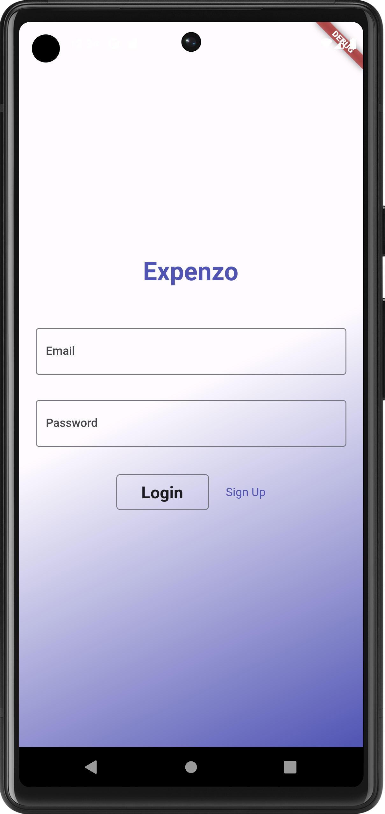
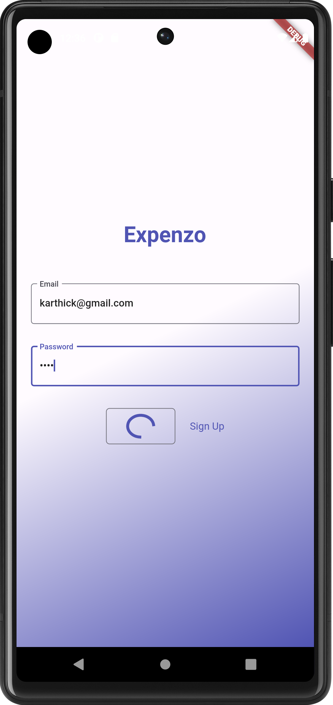
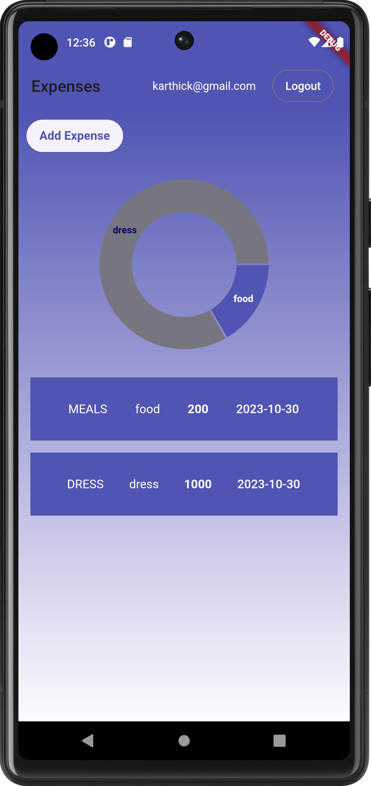
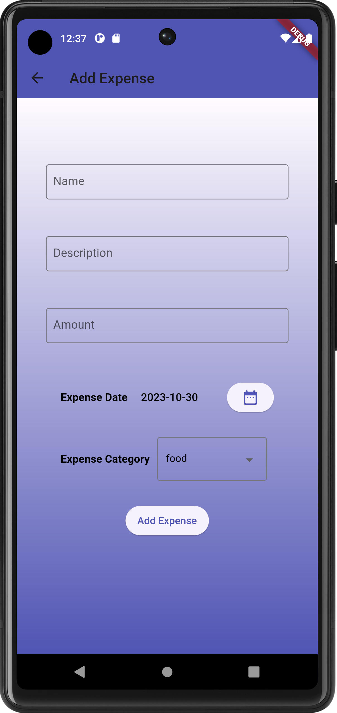

# Expenzo

**This is the Expense tracker app which lists all the expenses of the user**

## Tech stack
- Flutter, Bloc, Retrofit Dio, Floor, User Preference

## Features
- Lists all the expenses of the user
- Visualizes expenses in the form of chart
- Add expense with description and date
- Login with email and password
- Logout the user

## Screens
- **Auth Screens**

  
  

- **Expense Dashboard screen**

  

- **Add Expense screen**

  

